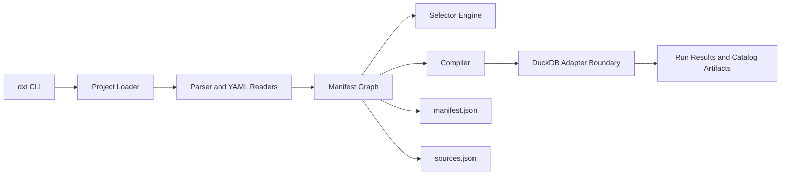

# dxt

<p align="center">
  <strong>Data eXecution & Transformation</strong>
  <br />
  A Zig-first, dbt-project-compatible transformation engine.
</p>

<p align="center">
  <a href="https://github.com/sabino/dxt/actions/workflows/ci.yml"></a>
  <a href="https://github.com/sabino/dxt/releases"></a>
  
  
</p>

`dxt` is building toward a fast native alternative for dbt Core projects. The
first target is artifact-compatible dbt Core behavior for public DuckDB fixtures
such as Jaffle Shop. Fusion-era static analysis, semantic resources, metrics,
and cross-database execution shape the architecture, but dbt Core compatibility
comes first.

This repository is **pre-alpha**. Do not use it for production data
transformations yet.

## Why dxt Exists

- **Native runtime:** implemented product surfaces are Zig; planned parser,
  compiler, planner, adapter, graph, artifact, and runner work must stay Zig.
- **Artifact-first compatibility:** generated artifacts are treated as public
  contracts and validated against pinned dbt-shaped schema slices.
- **Source-grounded implementation:** feature slices name the dbt Core v1 and
  Fusion source files they are matching.
- **Deterministic local validation:** synthetic fixtures and public Jaffle-style
  projects come before live warehouses.
- **Future cross-database execution:** relation identity, adapter capabilities,
  staging, and movement policies are explicit architecture concerns.

## Quick Start

Install Zig `0.16.0`, then build and smoke-test the native binary:

```sh
zig build
zig build test
./zig-out/bin/dxt --help
./zig-out/bin/dxt version
```

Run a small parse/list/compile flow:

```sh
./zig-out/bin/dxt parse --project-dir tests/fixtures/model_ref --target-path target-dxt
./zig-out/bin/dxt ls --project-dir tests/fixtures/model_ref --output json
./zig-out/bin/dxt ls --project-dir tests/fixtures/model_ref --output json --output-keys unique_id name
./zig-out/bin/dxt compile --project-dir tests/fixtures/compile_basic --target-path target-dxt
./zig-out/bin/dxt compile --project-dir tests/fixtures/generic_test_arguments --target-path target-dxt --select test_type:generic
```

Run the current DuckDB execution slices:

```sh
./zig-out/bin/dxt run --project-dir tests/fixtures/compile_basic --target-path target-dxt --select orders
./zig-out/bin/dxt seed --project-dir tests/fixtures/seed_ref --target-path target-dxt --select raw_customers
./zig-out/bin/dxt build --project-dir tests/fixtures/seed_ref --target-path target-dxt --select +stg_customers
./zig-out/bin/dxt run --project-dir tests/fixtures/model_properties --target-path target-dxt-tests --select customers
./zig-out/bin/dxt test --project-dir tests/fixtures/model_properties --target-path target-dxt-tests --select "not_null_customers_customer_id unique_customers_customer_id"
./zig-out/bin/dxt build --project-dir tests/fixtures/model_properties --target-path target-dxt --select "not_null_customers_customer_id unique_customers_customer_id"
./zig-out/bin/dxt build --project-dir tests/fixtures/source_column_tests --target-path target-dxt --select "source:raw.customers+"
./zig-out/bin/dxt docs generate --project-dir tests/fixtures/docs_blocks --target-path target-dxt
./zig-out/bin/dxt source freshness --project-dir tests/fixtures/source_freshness --target-path target-dxt --select source:raw.customers
```

DuckDB execution tests require the `duckdb` CLI on `PATH`. The current DuckDB
backend is a Zig-owned CLI boundary; the long-term adapter ABI should move to
embedded DuckDB or another native adapter boundary, not Python runtime calls.

## Documentation

| Document | Purpose |
| --- | --- |
| [Primer](docs/PRIMER.md) | Product goals, current workflow, architecture map, and development loop. |
| [Compatibility Matrix](docs/COMPATIBILITY.md) | Truthful current support vs planned dbt surfaces. |
| [Architecture](docs/ARCHITECTURE.md) | Module ownership, execution flow, and Mermaid diagrams. |
| [Agent OS](docs/AGENT_OS.md) | Multidisciplinary agent-team operating model plus local autonomous Codex worker loop across GitHub Issues, Projects, PRs, and worktrees. |
| [Agent Protocols](docs/AGENT_PROTOCOLS.md) | Public-safe issue/PR comment formats, role nudges, handoffs, and reflection protocol. |
| [GitHub Projects Setup](docs/GITHUB_PROJECTS.md) | Desired Project fields, views, label syncing, seed issue bootstrap, and worker-loop commands. |
| [Multi-Agent Workflow](docs/MULTI_AGENT_WORKFLOW.md) | Concurrent Codex/worktree workflow, project agent roles, autonomous orchestration, validation, and PR convergence. |
| [Release Process](docs/RELEASES.md) | GitHub release workflow, binary artifacts, checksums, and safety gates. |
| [Changelog](CHANGELOG.md) | Human-readable history of shipped pre-alpha slices. |
| [ExecPlan](PLAN.md) | Active engineering plan and milestone tracker. |
| [Agent Rules](AGENTS.md) | Durable rules for Zig runtime, planning, tests, PRs, and public safety. |

## Current Support Snapshot

| Area | Supported Now | Planned |
| --- | --- | --- |
| Commands | `parse`, `ls`, `clean`, `compile`, `run`, `seed`, `test`, `build`, `docs generate`, `docs serve`, `source freshness`, `version`, help | `debug`, `deps`, `init`, `run-operation`, `snapshot`, `retry`, `clone` |
| Runtime | Zig product runtime | Broader native adapter ABI and runner |
| Adapter | DuckDB through a Zig-owned external CLI backend | Embedded DuckDB, Postgres, cloud adapters, cross-database planner |
| Artifacts | `manifest.json`, `run_results.json`, `catalog.json`, `sources.json` slices | fuller dbt schemas, `semantic_manifest.json`, parse cache/state artifacts |
| dbt resources | models, analyses in parse/list/compile, seeds, sources with schema/freshness/identifier slices, exposures, docs, macros, supported generic tests in compile and the DuckDB subset, singular SQL tests in compile and the DuckDB subset, read-only unit-test manifest/list artifacts | snapshots, fuller analysis configs/tests, full singular-test configs/patches, unit-test execution, semantic models, metrics, saved queries |
| Jinja | literal, narrow scalar var-backed, and static loop-var `ref`/`source`, `doc`, inline `config`, static list `set` + simple `for`, narrow static `if`, selected `target`/`this` context | full parse/runtime context, macro execution, dispatch, filters, database-backed `execute`, adapter introspection |
| Selectors and listing | names/FQN, tags, paths/files, packages, resource types, sources, exposures, unit tests, config materialization, `*`/`?`/bracket-class wildcards, `+` and `@` graph expansion, excludes, `ls` `json`/`name`/`path`/`selector` output formats, and narrow compact-JSON resource/config/identity/dependency `--output-keys` including `alias`, `identifier`, `tags`, `config.materialized`, `config.tags`, `config.enabled`, `config.docs.show`, `depends_on.nodes`, and `depends_on.macros` | YAML selectors, state/defer/result/source-status selectors, full dbt JSON and arbitrary nested `--output-keys` |

See [docs/COMPATIBILITY.md](docs/COMPATIBILITY.md) for the detailed matrix.

## System Map



## Development

Run focused local gates from the repository root before committing:

```sh
zig build
zig build test
pytest -q tests/test_cli.py::test_name_for_the_changed_behavior
python scripts/check_runtime_boundary.py
python scripts/check_public_safety.py
```

Use the test layers deliberately:

- `zig build` compiles the native CLI.
- `zig build test` runs fast native unit/regression tests for core Zig logic.
- Focused `pytest` runs black-box integration and compatibility checks against
  the compiled Zig binary for touched CLI/artifact behavior.
- `python scripts/check_runtime_boundary.py` verifies Python has not crossed
  into product runtime responsibilities.
- `python scripts/check_public_safety.py` scans for local paths, secrets, caches,
  logs, and private artifacts.

Use full `pytest -q` locally for broad runner/artifact changes or before a
high-risk PR. Otherwise, let GitHub CI run the full integration matrix and
publish pytest JUnit reports for review. GitHub CI also runs the public Jaffle
parse, DuckDB build, DuckDB run, and docs-generate gates with a pinned,
checksum-verified DuckDB CLI, so routine local work can stay focused on the
touched layer. CI cancels superseded runs for the same branch or PR and applies
job timeouts so stale work does not consume runner time. The public fixture job
checks out the pinned Jaffle repository once and passes that checkout to each
gate to avoid repeated network clones.

Native Zig coverage is collected on GitHub, not as a required local gate. The
`Coverage` workflow runs on `src/` or build-file pull requests, pushes to
`main`, and manual dispatch. It runs native Zig tests, compiles the standalone
Zig test binary, and uploads a native test coverage map by source module for
review. This is intentionally not Python coverage and does not claim line
coverage for the Zig runtime.

For concurrent Codex work, use one branch and one git worktree per editing
agent. The project-scoped roles under `.codex/agents/` and helper scripts under
`scripts/worktree_*.sh` are documented in
[Multi-Agent Workflow](docs/MULTI_AGENT_WORKFLOW.md).
This repo also has project-local Codex subagent settings in `.codex/config.toml`
so restarts pick up the dxt-specific thread limits and role registry.
For issue/project-backed coordination across multiple specialist roles, use
[Agent OS](docs/AGENT_OS.md), [Agent Protocols](docs/AGENT_PROTOCOLS.md), and
[GitHub Projects Setup](docs/GITHUB_PROJECTS.md).
To let development continue from ready GitHub issues into local Codex worker
subprocesses, run `python scripts/agent_os_orchestrator.py run --profile azure
--model gpt-5.5 --max-workers 3 --loop` from a clean supervisor checkout.
Use `python scripts/agent_os_orchestrator.py product-manager --profile azure
--model gpt-5.5 --dry-run` to preview the Product Manager launch command and
GitHub Project scope check. Remove `--dry-run` only when you want the Product
Manager agent to write repo-scoped GitHub issue, label, or Project updates
before launching workers.
When project-local Codex settings change, use the pull-plug helpers documented
in [Agent OS](docs/AGENT_OS.md): detached relaunches use
`scripts/codex_pull_plug.py`, while exact visible-terminal restarts require
launching Codex through `scripts/codex_tmux_supervisor.py` first.

Optional compatibility gates:

```sh
python scripts/check_jaffle_shop_duckdb_parse.py
python scripts/check_jaffle_shop_duckdb_build.py
python scripts/check_jaffle_shop_duckdb_run.py
python scripts/check_jaffle_shop_duckdb_docs.py
python scripts/check_dbt_core_m1_oracle.py
```

The Jaffle scripts use public fixtures and may clone their pinned refs by
default. Pass `--project-dir path/to/jaffle_shop_duckdb` to run against an
existing checkout. The build, run, and docs gates require the `duckdb` CLI on
`PATH` when run locally.

## Release Builds

Tagged releases are built by [release.yml](.github/workflows/release.yml).
Release artifacts are native `dxt` binaries packaged per target with a
`SHA256SUMS.txt` file. Initial binary releases are Linux-only because current
file discovery is Linux-specific; macOS and Windows artifacts are planned after
that path is portable. See [docs/RELEASES.md](docs/RELEASES.md).

## Status

Pre-alpha. The shipped surface is intentionally narrow and documented. The next
work remains dbt Core compatibility first: wider Jinja/macro behavior, stronger
runner semantics, broader selector parity, fuller artifacts, and public
Jaffle-style compatibility coverage.
