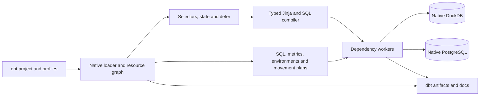

# dxt

<p align="center">
  <strong>Data eXecution & Transformation</strong>
  <br />
  A native, dbt-project-compatible transformation engine.
</p>

<p align="center">
  <a href="https://github.com/sabino/dxt/actions/workflows/ci.yml"></a>
  <a href="https://github.com/sabino/dxt/releases"></a>
  
  
</p>

`dxt` loads dbt projects, compiles typed Jinja and SQL, executes resource graphs
and writes dbt artifacts through a native Zig binary. The initial execution
scope is **SQL models on DuckDB and PostgreSQL**. Python model files remain
visible in discovery, parsing, selection and compilation; selecting them for
execution fails before warehouse writes. Authored Python is never run.

Native semantic queries, typed SQL analysis, versioned environments and
governed cross-database execution are also implemented. They have namespaced
commands and artifacts alongside the dbt-compatible interface.

Compatibility evidence targets dbt Core **1.10.5**, dbt-duckdb **1.9.6**,
dbt-postgres **1.9.1**, MetricFlow **0.208.1** and semantic interfaces **0.9.0**.
The integrated release checks are still in progress. Consult the
[compatibility matrix](docs/COMPATIBILITY.md) for supported behavior,
intentional differences and pending gates; this is not a universal dbt or
adapter certification claim. The project is independent of dbt Labs.

## Quick Start

Build the current source with Zig **0.16.0**. The
[release process](docs/RELEASES.md) describes packaged installation once the
candidate passes its release gates.

```sh
zig build -Doptimize=ReleaseSafe
export PATH="$PWD/zig-out/bin:$PATH"
dxt version
```

Install DuckDB's native library so `libduckdb.so` is discoverable, or select
the installed library with `DXT_DUCKDB_LIBRARY`. Then create and build a local
project:

```sh
export DXT_DUCKDB_BACKEND=native
dxt init demo
dxt debug --project-dir demo --profiles-dir demo
dxt build --project-dir demo --profiles-dir demo --threads 2
dxt docs generate --project-dir demo --profiles-dir demo --static
dxt docs serve --project-dir demo --profiles-dir demo --port 8080 --no-browser
```

The scaffold includes a DuckDB profile, seed, model and data tests. Generated
artifacts are written to `demo/target`; static docs include an offline
`static_index.html`. Stop the docs server with Ctrl+C.

Existing projects retain their dbt project files, profiles, SQL and packages.
Use `--project-dir`, `--profiles-dir`, `--profile` and `--target` as needed.
PostgreSQL uses a dbt `type: postgres` profile and native libpq, discovered as
`libpq.so.5` or selected with `DXT_POSTGRES_LIBRARY`. End users do not need
Python, dbt or MetricFlow installed. Dependency fetching/extraction uses
system `git`, `curl` and `tar` for the corresponding package transports.

## Implemented Surface

| Area | Native implementation |
| --- | --- |
| Project and resources | Shared YAML/config precedence, packages, versions, groups/access, models, analyses, seeds, sources, SQL/YAML snapshots, macros, docs, exposures, data/unit tests and semantic resources. |
| Compiler | Typed expressions and containers, macro arguments/returns, dispatch, bundled upstream SQL macros, Relation/Column/timestamp context, database-backed queries/statements and adapter introspection. |
| Execution | Native DuckDB/libpq sessions, dependency workers, ephemeral ancestry, unit-test gates, durable errors/skips, fail-fast cancellation, transactions and retry. |
| Materializations | Table/view, adapter-specific incremental strategies and schema changes, microbatch, seeds, timestamp/check snapshots and state-based clone views; PostgreSQL materialized views and DuckDB local external/table-function resources. |
| Selection and integration | Graph/YAML selectors, indirect selection, state comparisons, defer/favor-state, effective command/env options, structured logs, real debug/init/operations, docs and freshness. |
| Artifacts and caches | Manifest v12, Run Results v6, Catalog v1, Sources v3, semantic manifests, native parse/relation/SQL caches and the embedded dbt docs application. |
| SQL analysis | Native dialect grammars, typed logical IR, column lineage, source diagnostics, explain output and dependency-aware invalidation. |
| Metrics | Simple, derived, ratio, cumulative and conversion planning, entity/grain checks, time spines/windows, saved queries and transactional exports. |
| Cross-database | Named connections, source reduction/pushdown, typed movement, retained stages, incremental watermarks, policy/budget guards, locks, recovery and adaptive task retries. |
| Environments | Immutable model versions, isolated environment views, physical reuse, interval/backfill accounting, audits, promotion and rollback. |

These rows describe implemented capabilities with focused evidence. Remaining
materialization lifecycle work, package-heavy public-project validation and
final platform/release checks are tracked in the
[replacement roadmap](docs/DBT_REPLACEMENT_ROADMAP.md).

## System Map


```mermaid
flowchart LR
    Files[dbt project and profiles] --> Graph[Native loader and resource graph]
    Graph --> Select[Selectors, state and defer]
    Select --> Compile[Typed Jinja and SQL compiler]
    Compile --> Workers[Dependency workers]
    Workers --> DuckDB[(Native DuckDB)]
    Workers --> PG[(Native PostgreSQL)]
    Graph --> Plans[SQL, metrics, environments and movement plans]
    Plans --> Workers
    Graph --> Artifacts[dbt artifacts and docs]
    Workers --> Artifacts
```

## Documentation

| Document | Purpose |
| --- | --- |
| [Primer](docs/PRIMER.md) | Runnable workflows and command families. |
| [Compatibility](docs/COMPATIBILITY.md) | Versioned support, evidence and explicit boundaries. |
| [Replacement roadmap](docs/DBT_REPLACEMENT_ROADMAP.md) | Core/proposed feature coverage and remaining acceptance gates. |
| [Architecture](docs/ARCHITECTURE.md) | Native modules, execution flow and dependencies. |
| [Releases](docs/RELEASES.md) | Linux x86_64/ARM archives, notices, checksums and installation checks. |
| [Performance](docs/PERFORMANCE.md) | Correctness-aware cold/warm measurement and budgets. |
| [Changelog](CHANGELOG.md) | Unreleased implementation changes and earlier history. |
| [ExecPlan](PLAN.md) | Active integration and validation work. |
| [Agent rules](AGENTS.md) | Runtime, planning and public-safety requirements. |
| [Multi-agent workflow](docs/MULTI_AGENT_WORKFLOW.md) | Isolated branch/worktree ownership and convergence. |
| [Agent OS](docs/AGENT_OS.md), [protocols](docs/AGENT_PROTOCOLS.md), [GitHub Projects](docs/GITHUB_PROJECTS.md) | Repository coordination and developer automation. |

## Development And Verification

Python requirements are developer-only oracle and fixture dependencies:

```sh
python -m pip install -r requirements-dev.txt -r requirements-oracle.txt
zig build
zig build test
pytest -q tests/test_usability_scheduler.py
python scripts/check_runtime_boundary.py
python scripts/check_public_safety.py
```

Native database and browser fixtures are required for the complete suite.
[CI fixture setup](.github/actions/setup-oracles/action.yml) documents the
pinned dependencies; the portable PostgreSQL helper can use installed native
tools through `DXT_POSTGRES_BIN`. Run `pytest -q` for integrated validation and
`python scripts/validate_dbt_artifacts.py <artifact.json>` for complete upstream
artifact schemas.

CI configures native tests/safety, full compatibility fixtures, all six public
Jaffle steps, an unchanged PostgreSQL dbt-utils project, performance checks and
actual Linux x86_64/ARM installation tests. Release jobs extract the real
checksum-validated archive and exercise both adapters with PATH empty. These
configured gates must pass on the final candidate before claiming release
readiness; earlier focused successes do not replace that final run.

Optional native coverage artifacts are produced by the
[Coverage workflow](.github/workflows/coverage.yml). They supplement the CLI,
warehouse and artifact comparisons rather than replacing compatibility gates.
