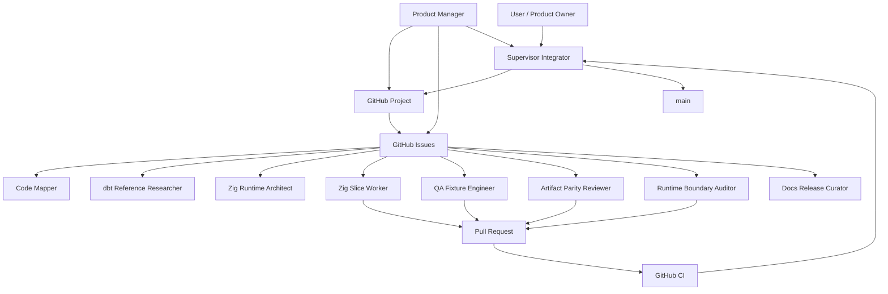
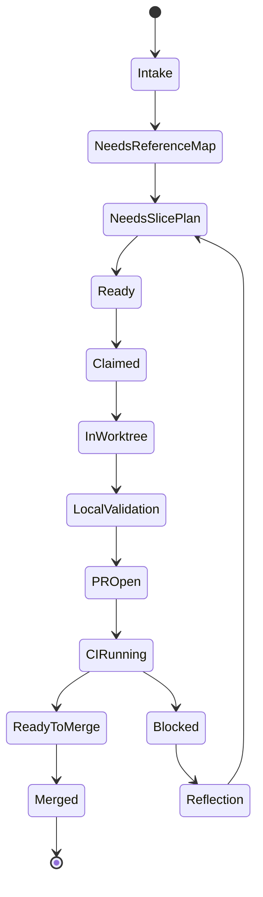

# Agent OS

`dxt` uses a small agent operating model to coordinate long-running dbt
compatibility work without turning the repository into an unstructured chat
log.

GitHub Issues and Projects are the shared public coordination state. `PLAN.md`
remains the active ExecPlan for sequencing, cross-slice risks, current status,
and validation policy. Worktrees remain the execution boundary for code changes.

## Autonomous Local Loop

The GitHub Issues and Project are not the automation engine by themselves. They
are the public queue and status board. The local engine is
[`scripts/agent_os_orchestrator.py`](../scripts/agent_os_orchestrator.py), which
can claim ready issues, create isolated worktrees, launch `codex exec` workers,
record ignored run logs, and optionally merge green PRs.

The visible tmux Codex session is the supervisor, not the default implementation
worker. It should inspect state, choose issues, launch and monitor workers,
publish or merge green PRs when policy allows, and repair orchestration bugs.
Actual issue implementation and PR-boundary review should run in separate
worktrees through worker subprocesses.

The product-manager agent is the board steward. Run it when you want queue
health checks, priority/readiness nudges, stale-claim detection, and a concise
next-issue recommendation before launching implementation workers. Its local
filesystem sandbox is read-only, but it is GitHub-write automation: it may add
public-safe issue comments, labels, and Project field updates for `sabino/dxt`.

First bootstrap the public queue:

```sh
python scripts/agent_os_orchestrator.py setup \
  --repo sabino/dxt \
  --apply-labels \
  --seed-issues
```

GitHub Projects need a token with project scopes. The `read:project` scope lets
the scripts inspect Projects; the `project` scope is needed to create/update the
board and fields.

```sh
gh auth refresh -s read:project -s project
python scripts/agent_os_orchestrator.py setup \
  --repo sabino/dxt \
  --apply-project \
  --sync-project-items
```

Start one autonomous batch:

```sh
python scripts/agent_os_orchestrator.py run \
  --repo sabino/dxt \
  --profile azure \
  --model gpt-5.5 \
  --max-workers 4
```

Run a long local supervisor loop:

```sh
python scripts/agent_os_orchestrator.py run \
  --repo sabino/dxt \
  --profile azure \
  --model gpt-5.5 \
  --max-workers 4 \
  --loop \
  --poll-seconds 900 \
  --merge-ready
```

Useful control commands:

```sh
python scripts/agent_os_orchestrator.py status
python scripts/agent_os_orchestrator.py product-manager --repo sabino/dxt --profile azure --model gpt-5.5 --dry-run
python scripts/agent_os_orchestrator.py product-manager --repo sabino/dxt --profile azure --model gpt-5.5
python scripts/agent_os_orchestrator.py nudge 123 "Narrow this to manifest fields only."
python scripts/agent_os_orchestrator.py merge-ready --repo sabino/dxt --apply --delete-branch
python scripts/agent_os_orchestrator.py stop --issue 123
```

Run state and logs are written under ignored `.agent/runs/agent-os/`. Do not
commit them. Nudges are issue comments; running workers are instructed to read
recent issue comments before major decisions, and the supervisor loop will pick
up new issue state on the next polling cycle.

When `--max-workers` is omitted, the orchestrator uses
`.github/agent-team/orchestrator.json` `default_max_workers`, currently `4`.
Pass `--max-workers` to lower or raise the local batch size for the current
machine.

Detached Agent OS workers launch through `codex exec` with
`danger-full-access` in this repository. That is intentional: these workers are
expected to use the host GitHub CLI auth/keyring, push branches, open PRs, and
write Git metadata that may live outside the individual worktree directory. The
role files still define behavioral boundaries such as read-only review or
single-slice implementation, but the filesystem sandbox is not the enforcement
mechanism for autonomous GitHub-backed work. Run this orchestrator only for this
trusted repository.

If a future read-only reviewer is not allowed to use GitHub or write branches,
route all comments, pushes, and PR updates through the supervisor instead of
asking that reviewer subprocess to publish.

The Product Manager `--dry-run` previews the launch command and GitHub Project
scope check, board snapshot size, prompt source files, backlog synthesis rule,
PM issue contract, and public-safety guard. It does not ask the model for a
no-write board plan; remove `--dry-run` only when repo-scoped issue, label, or
Project writes are intended.

## Company Loop

The intended operating model is a small software company, not a single worker
queue. The loop has four layers:

1. Product Manager / board steward: inspect issues, Project state, `PLAN.md`,
   support docs, and recent PRs; add or update missing roadmap slices; label
   readiness, role, priority, risk, validation, and dependencies.
2. Supervisor / principal engineer: choose the next batch, avoid branch/file
   conflicts, launch workers in separate worktrees, monitor status, watch CI,
   converge PRs, merge green changes, clean up worktrees, and feed results back
   to the PM.
3. Specialist network: use researcher, mapper, planner, QA, artifact, safety,
   docs, and reflection roles before and after implementation when an issue is
   complex or risky.
4. Implementation workers: own one branch/worktree and one coherent slice, then
   publish a PR with validation evidence.

Run the PM loop before a worker batch when the board is empty, stale, or too
broad:

```sh
python scripts/agent_os_orchestrator.py product-manager \
  --repo sabino/dxt \
  --profile azure \
  --model gpt-5.5
```

Run implementation only after the board has ready, scoped issues:

```sh
python scripts/agent_os_orchestrator.py run \
  --repo sabino/dxt \
  --profile azure \
  --model gpt-5.5 \
  --loop \
  --merge-ready
```

Use `status`, `nudge`, `stop`, and `merge-ready` from the supervisor pane
between batches. Do not use the main tmux session for long feature
implementation unless the feature is an orchestration fix.

### PM Backlog Synthesis Contract

The PM pass must keep the queue alive without waiting for a human to pre-create
every issue. Treat the board as empty or stale when the snapshot has no open
issues, no ready unclaimed issues outside blocked/claimed/review labels, or
only Agent OS infrastructure work while `PLAN.md` and compatibility docs name
immediate dbt Core compatibility gaps.

When that happens, the PM should create or update roadmap-gap issues rather than
only reporting the gap. A PM-created issue must include role, priority,
readiness, risk, validation, dependencies or sequencing notes, acceptance
criteria, and stop conditions. Prefer these body sections for new issues:
Objective, Current Reality, Role and Labels, Priority, Readiness, Risk,
Dependencies / Sequencing, Acceptance Criteria, Validation, and Stop Condition.

PM issue bodies and comments are public coordination state. They must not
include local absolute paths, private hostnames or mounts, secrets, tokens, raw
command logs, raw Codex/session transcripts, or `.agent/runs/` contents. The PM
pass may recommend the next supervisor/orchestrator command, but it stops before
launching implementation workers.

### Capability Reality Check

| Capability | Current state |
| --- | --- |
| GitHub labels, seed issues, issue templates, and Project manifest | Real. `setup` can sync these from `.github/agent-team/`. |
| PM board steward subprocess | Real and prompt-driven, with a deterministic launch contract check. It can inspect the board and use GitHub writes, including roadmap-gap issue creation; issue synthesis is still performed by the PM subprocess rather than a separate rule engine. |
| Parallel worker launches | Real. `run` claims ready issues, creates worktrees, and launches up to `default_max_workers` workers. |
| Worker GitHub publication | Real for autonomous workers launched by the orchestrator because they use `danger-full-access`. |
| Merge of green PRs | Real but simple. `merge-ready` merges non-draft PRs whose checks are green; it does not yet model dependencies or file conflicts. |
| Multi-stage PM/research/mapper/worker/reviewer pipeline | Partially real through roles and labels; orchestration is still manual/prompt-driven. |
| Principal conflict graph and merge queue | Aspirational. The supervisor must currently reason from `git worktree`, PRs, labels, and CI status. |
| Automatic Project field reconciliation during every loop | Partially real. Setup can sync items; live per-issue field updates are still PM/supervisor work. |
| Stale worktree and stale claim cleanup | Partially real through `status` and `stop`; automated cleanup needs a follow-up slice. |

## Codex Pull Plug

Use the pull plug when this repo changes project-scoped Codex settings under
`.codex/` and the current process needs a restart to pick them up. The detached
helper writes an ignored request and handoff under
`.agent/runs/agent-os/pull-plug/`; it does not terminate the active Codex
process and does not reuse the visible terminal.

Start a detached local guardian:

```sh
python scripts/codex_pull_plug.py start-guardian
```

Request a restart handoff:

```sh
python scripts/codex_pull_plug.py request \
  --reason "reload project-scoped Codex agent settings" \
  --resume-prompt "Resume Agent OS setup, inspect git status, and continue from PLAN.md."
```

Check or cancel the request:

```sh
python scripts/codex_pull_plug.py status
python scripts/codex_pull_plug.py cancel
python scripts/codex_pull_plug.py stop-guardian
```

Hermes, cron, or another host supervisor can use the detached contract by running
`python scripts/codex_pull_plug.py watch --poll-seconds 30`. The guardrail is
simple: only request a restart when the current agent is about to stop or has
written a handoff, and do not use it to launch a competing worker for the same
dirty branch or GitHub issue.

### Exact Terminal Restart

Restarting in the exact visible terminal tile requires Codex to be launched
inside a supervisor that owns that terminal. Use tmux for future sessions. Copy
the session id from `/status` or pass `--last`; the `CODEX_THREAD_ID`
environment variable is only guaranteed inside Codex tool subprocesses, not in
your normal login shell:

```sh
python scripts/codex_tmux_supervisor.py start \
  --session dxt-codex \
  --session-id <session-id> \
  --profile azure \
  --model gpt-5.5 \
  --attach
```

Start the tmux watcher in another shell or through Hermes:

```sh
python scripts/codex_tmux_supervisor.py start-guardian
```

When a settings reload is needed, request it first:

```sh
python scripts/codex_tmux_supervisor.py request \
  --reason "reload project-scoped Codex settings" \
  --session-id <session-id> \
  --resume-note "Continue Agent OS work after checking git status."
```

The watcher does nothing while the request is only `requested`. After the
current Codex turn has finished all required work, written a handoff, and is
safe to exit, mark it ready:

```sh
python scripts/codex_tmux_supervisor.py ready --note "handoff written and branch is coherent"
```

Only then may the watcher send `/goal pause`, send `/exit`, wait for Codex to
leave the pane, and respawn `codex resume <session-id>` in that same tmux pane.
If Codex does not exit before the timeout, the watcher marks the request failed
instead of respawning over a live process. This avoids interrupting in-flight
work.

Hermes can provide the persistent observer layer. The repo-local tick command is
safe for Hermes because it only acts on `ready_to_exit` requests:

```sh
python scripts/hermes_codex_watchdog.py --to telegram
```

To install an optional Hermes cron wrapper, run:

```sh
python scripts/install_hermes_codex_watchdog.py --install-cron --to telegram
```

That installer writes a small wrapper under Hermes' script directory because
Hermes cron requires scripts there; the actual behavior remains in this
repository. Use `--dry-run` first if you want to preview the host-side change.

Autonomy stop conditions:

- no ready issues remain;
- worker count is already at the configured limit;
- an issue is blocked, claimed by another worker, or lacks enough scope;
- a worker opens a PR and CI is red;
- runtime-boundary or public-safety scans fail;
- GitHub auth lacks the required repository or project scopes.

## Operating Split

| Surface | Purpose | Public-safe rule |
| --- | --- | --- |
| GitHub Issue | One unit of work, research question, bug, compatibility slice, or release task. | Use relative repo paths and public upstream references. |
| GitHub Project | Live coordination state across issues, roles, branches, blockers, and validation. | Store branch names, not local worktree paths. |
| Pull Request | Integration artifact with diff, validation, CI, and merge decision. | Link the issue and summarize evidence. |
| `PLAN.md` | Durable sequencing, risks, milestone status, validation changes. | Update only when scope, risk, or sequencing changes. |
| `docs/MULTI_AGENT_WORKFLOW.md` | Local worktree mechanics and PR convergence. | Keep examples path-neutral. |
| `.codex/config.toml` | Project-scoped subagent limits, role registry, nicknames, and public MCP setup. | Keep provider auth and secrets machine-local. |
| `.codex/agents/` | dxt-specific helper roles. | Roles are helpers, not mandatory merge gates. |
| `scripts/agent_os_orchestrator.py` | Local supervisor loop that launches Codex workers and manages queue/PR state. | Developer-side automation only; keep logs ignored. |
| `.agent/runs/` | Ignored raw local logs and disposable notes. | Never copy raw logs into tracked files or issues. |
| `.agent/research/` | Durable public-safe research notes. | Scan before committing. |

## Team Topology



## Roles

| Role | Agent | Responsibility |
| --- | --- | --- |
| Product Manager | `dxt_product_manager` | Monitor board health, priorities, readiness, stale claims, blockers, and issue nudges. Filesystem read-only; may write repo-scoped GitHub issue/project state. |
| Supervisor / Integrator | `dxt_supervisor_integrator` or the main Codex thread | Triage issues, allocate branches/worktrees, prevent overlap, update `PLAN.md`, merge after green CI. |
| Issue Triager | `dxt_issue_triager` | Normalize issue fields, labels, project status, and readiness. |
| Compatibility Curator | `dxt_compatibility_curator` | Turn roadmap gaps into small dbt-compatible issues and keep support docs honest. |
| Code Mapper | `dxt_code_mapper` | Map owning Zig modules, fixtures, artifacts, and validation before work starts. |
| dbt Reference Researcher | `dxt_dbt_reference_researcher` | Name dbt Core v1 and Fusion references, affected artifact fields, and stop conditions. |
| Zig Runtime Architect | `dxt_zig_runtime_architect` | Guard module boundaries, dependency direction, adapter ABI direction, and `src/project.zig` shrinkage. |
| Zig Slice Worker | `dxt_zig_slice_worker` | Implement one scoped product slice in Zig in one branch/worktree. |
| Jinja/Macro Specialist | `dxt_jinja_macro_specialist` | Own parse-vs-execute Jinja, macro namespace, adapter dispatch, and macro dependency behavior. |
| Selector/State Specialist | `dxt_selector_state_specialist` | Own selector parity, YAML selectors, graph expansion, state/defer/result/source-status behavior. |
| Execution/Adapter Specialist | `dxt_execution_adapter_specialist` | Own DuckDB execution, future adapter ABI, run results, source freshness, and catalog behavior. |
| Semantic/Cross-DB Planner | `dxt_semantic_crossdb_planner` | Own semantic layer direction, metrics, capability matrices, staging, and movement policy. |
| QA Fixture Engineer | `dxt_qa_fixture_engineer` | Own fixture ladder, dbt oracle checks, focused pytest, public Jaffle gates, and CI signal quality. |
| Artifact Parity Reviewer | `dxt_artifact_parity_reviewer` | Review dbt-shaped JSON artifacts, schema fields, ordering, and normalization. |
| Runtime Boundary Auditor | `dxt_runtime_boundary_auditor` | Confirm Python stays developer-only and public-safety scans stay clean. |
| Reflection Reviewer | `dxt_reflection_reviewer` | Re-check assumptions after failures, drift, or repeated blockers. |
| Network Coordinator | `dxt_network_coordinator` | Coordinate peer specialist reviews without turning them into merge gates. |
| Docs Release Curator | `dxt_docs_release_curator` | Maintain README, docs, changelog, releases, and compatibility wording. |

## Coordination Patterns

### Supervisor

Use this for queue hygiene, branch allocation, PR convergence, and issue
readiness. The supervisor owns decisions; specialists provide evidence.

Stop condition: the issue lacks scope, validation, owner modules, or conflicts
with another active branch.

### Hierarchical

Use this for multi-file or multi-command compatibility milestones. The
supervisor creates a parent issue and child issues with non-overlapping scopes.

Stop condition: two child issues need the same Zig module or fixture without a
sequencing note in `PLAN.md`.

### Network

Use this for independent specialist review or research. Mapper, dbt researcher,
artifact reviewer, QA, and safety auditor can comment independently on the same
issue or PR.

Stop condition: comments disagree on the source of truth. Escalate to a
reflection pass and update the issue with the decision.

### Reflection

Use this after repeated CI failures, upstream dbt/Fusion ambiguity, artifact
schema drift, runtime-boundary risk, or public-safety findings.

Stop condition: the reflection changes sequencing, risk, or validation policy.
Update `PLAN.md` and keep the issue comment concise.

## Lifecycle



## Readiness Checklist

An issue is ready for a worktree when it names:

- Scope and non-goals.
- Owning dxt Zig modules.
- Upstream dbt Core v1 and Fusion references, or `not applicable`.
- Affected artifacts and fields.
- Native Zig tests expected.
- Python/dbt oracle or fixture checks expected.
- Public-safety and runtime-boundary risk.
- Branch/worktree scope.
- Stop conditions.

## Merge Policy

Agent reviews are advisory by default. A PR can merge after required CI is green
and the issue's required validation evidence is present. Specialist review is a
merge gate only when the issue explicitly says so.
