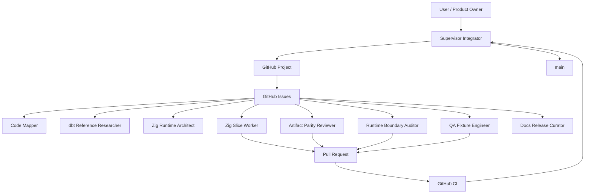
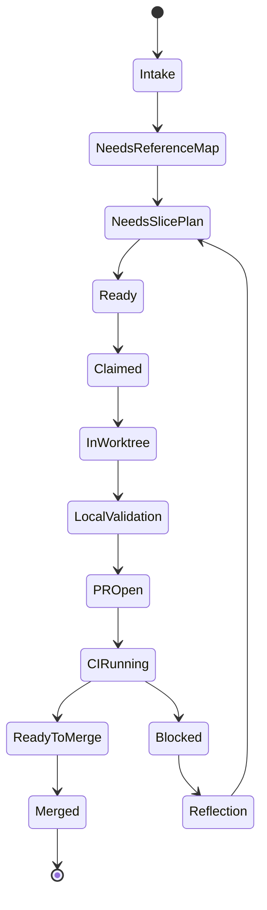

# Agent OS

`dxt` uses a small agent operating model to coordinate long-running dbt
compatibility work without turning the repository into an unstructured chat
log.

GitHub Issues and Projects are the shared public coordination state. `PLAN.md`
remains the active ExecPlan for sequencing, cross-slice risks, current status,
and validation policy. Worktrees remain the execution boundary for code changes.

## Autonomous Local Loop

The GitHub Issues and Project are not the automation engine by themselves. They
are the public queue and status board. The local engine is
[`scripts/agent_os_orchestrator.py`](../scripts/agent_os_orchestrator.py), which
can claim ready issues, create isolated worktrees, launch `codex exec` workers,
record ignored run logs, and optionally merge green PRs.

First bootstrap the public queue:

```sh
python scripts/agent_os_orchestrator.py setup \
  --repo sabino/dxt \
  --apply-labels \
  --seed-issues
```

GitHub Projects need a token with project scopes:

```sh
gh auth refresh -s read:project -s project
python scripts/agent_os_orchestrator.py setup \
  --repo sabino/dxt \
  --apply-project
```

Start one autonomous batch:

```sh
python scripts/agent_os_orchestrator.py run \
  --repo sabino/dxt \
  --profile azure \
  --model gpt-5.5 \
  --max-workers 3
```

Run a long local supervisor loop:

```sh
python scripts/agent_os_orchestrator.py run \
  --repo sabino/dxt \
  --profile azure \
  --model gpt-5.5 \
  --max-workers 3 \
  --loop \
  --poll-seconds 900 \
  --merge-ready
```

Useful control commands:

```sh
python scripts/agent_os_orchestrator.py status
python scripts/agent_os_orchestrator.py nudge 123 "Narrow this to manifest fields only."
python scripts/agent_os_orchestrator.py merge-ready --repo sabino/dxt --apply --delete-branch
python scripts/agent_os_orchestrator.py stop --issue 123
```

Run state and logs are written under ignored `.agent/runs/agent-os/`. Do not
commit them. Nudges are issue comments; running workers are instructed to read
recent issue comments before major decisions, and the supervisor loop will pick
up new issue state on the next polling cycle.

Autonomy stop conditions:

- no ready issues remain;
- worker count is already at the configured limit;
- an issue is blocked, claimed by another worker, or lacks enough scope;
- a worker opens a PR and CI is red;
- runtime-boundary or public-safety scans fail;
- GitHub auth lacks the required repository or project scopes.

## Operating Split

| Surface | Purpose | Public-safe rule |
| --- | --- | --- |
| GitHub Issue | One unit of work, research question, bug, compatibility slice, or release task. | Use relative repo paths and public upstream references. |
| GitHub Project | Live coordination state across issues, roles, branches, blockers, and validation. | Store branch names, not local worktree paths. |
| Pull Request | Integration artifact with diff, validation, CI, and merge decision. | Link the issue and summarize evidence. |
| `PLAN.md` | Durable sequencing, risks, milestone status, validation changes. | Update only when scope, risk, or sequencing changes. |
| `docs/MULTI_AGENT_WORKFLOW.md` | Local worktree mechanics and PR convergence. | Keep examples path-neutral. |
| `.codex/config.toml` | Project-scoped subagent limits, role registry, nicknames, and public MCP setup. | Keep provider auth and secrets machine-local. |
| `.codex/agents/` | dxt-specific helper roles. | Roles are helpers, not mandatory merge gates. |
| `scripts/agent_os_orchestrator.py` | Local supervisor loop that launches Codex workers and manages queue/PR state. | Developer-side automation only; keep logs ignored. |
| `.agent/runs/` | Ignored raw local logs and disposable notes. | Never copy raw logs into tracked files or issues. |
| `.agent/research/` | Durable public-safe research notes. | Scan before committing. |

## Team Topology



## Roles

| Role | Agent | Responsibility |
| --- | --- | --- |
| Supervisor / Integrator | `dxt_supervisor_integrator` or the main Codex thread | Triage issues, allocate branches/worktrees, prevent overlap, update `PLAN.md`, merge after green CI. |
| Issue Triager | `dxt_issue_triager` | Normalize issue fields, labels, project status, and readiness. |
| Compatibility Curator | `dxt_compatibility_curator` | Turn roadmap gaps into small dbt-compatible issues and keep support docs honest. |
| Code Mapper | `dxt_code_mapper` | Map owning Zig modules, fixtures, artifacts, and validation before work starts. |
| dbt Reference Researcher | `dxt_dbt_reference_researcher` | Name dbt Core v1 and Fusion references, affected artifact fields, and stop conditions. |
| Zig Runtime Architect | `dxt_zig_runtime_architect` | Guard module boundaries, dependency direction, adapter ABI direction, and `src/project.zig` shrinkage. |
| Zig Slice Worker | `dxt_zig_slice_worker` | Implement one scoped product slice in Zig in one branch/worktree. |
| Jinja/Macro Specialist | `dxt_jinja_macro_specialist` | Own parse-vs-execute Jinja, macro namespace, adapter dispatch, and macro dependency behavior. |
| Selector/State Specialist | `dxt_selector_state_specialist` | Own selector parity, YAML selectors, graph expansion, state/defer/result/source-status behavior. |
| Execution/Adapter Specialist | `dxt_execution_adapter_specialist` | Own DuckDB execution, future adapter ABI, run results, source freshness, and catalog behavior. |
| Semantic/Cross-DB Planner | `dxt_semantic_crossdb_planner` | Own semantic layer direction, metrics, capability matrices, staging, and movement policy. |
| QA Fixture Engineer | `dxt_qa_fixture_engineer` | Own fixture ladder, dbt oracle checks, focused pytest, public Jaffle gates, and CI signal quality. |
| Artifact Parity Reviewer | `dxt_artifact_parity_reviewer` | Review dbt-shaped JSON artifacts, schema fields, ordering, and normalization. |
| Runtime Boundary Auditor | `dxt_runtime_boundary_auditor` | Confirm Python stays developer-only and public-safety scans stay clean. |
| Reflection Reviewer | `dxt_reflection_reviewer` | Re-check assumptions after failures, drift, or repeated blockers. |
| Network Coordinator | `dxt_network_coordinator` | Coordinate peer specialist reviews without turning them into merge gates. |
| Docs Release Curator | `dxt_docs_release_curator` | Maintain README, docs, changelog, releases, and compatibility wording. |

## Coordination Patterns

### Supervisor

Use this for queue hygiene, branch allocation, PR convergence, and issue
readiness. The supervisor owns decisions; specialists provide evidence.

Stop condition: the issue lacks scope, validation, owner modules, or conflicts
with another active branch.

### Hierarchical

Use this for multi-file or multi-command compatibility milestones. The
supervisor creates a parent issue and child issues with non-overlapping scopes.

Stop condition: two child issues need the same Zig module or fixture without a
sequencing note in `PLAN.md`.

### Network

Use this for independent specialist review or research. Mapper, dbt researcher,
artifact reviewer, QA, and safety auditor can comment independently on the same
issue or PR.

Stop condition: comments disagree on the source of truth. Escalate to a
reflection pass and update the issue with the decision.

### Reflection

Use this after repeated CI failures, upstream dbt/Fusion ambiguity, artifact
schema drift, runtime-boundary risk, or public-safety findings.

Stop condition: the reflection changes sequencing, risk, or validation policy.
Update `PLAN.md` and keep the issue comment concise.

## Lifecycle



## Readiness Checklist

An issue is ready for a worktree when it names:

- Scope and non-goals.
- Owning dxt Zig modules.
- Upstream dbt Core v1 and Fusion references, or `not applicable`.
- Affected artifacts and fields.
- Native Zig tests expected.
- Python/dbt oracle or fixture checks expected.
- Public-safety and runtime-boundary risk.
- Branch/worktree scope.
- Stop conditions.

## Merge Policy

Agent reviews are advisory by default. A PR can merge after required CI is green
and the issue's required validation evidence is present. Specialist review is a
merge gate only when the issue explicitly says so.
