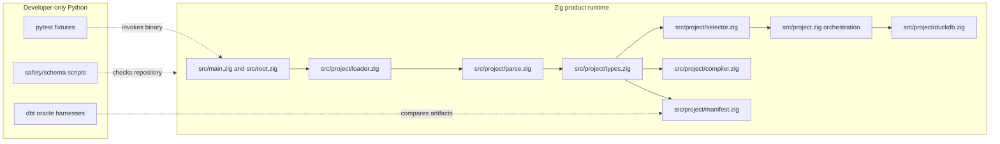
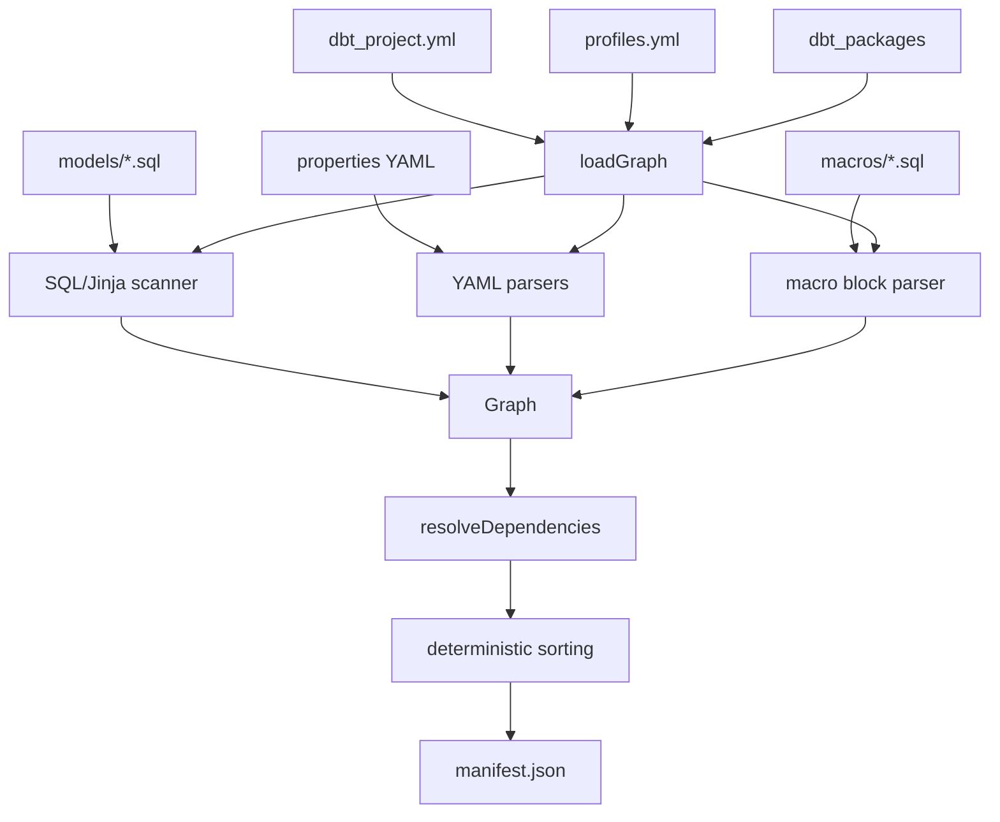
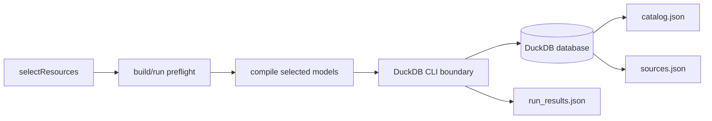
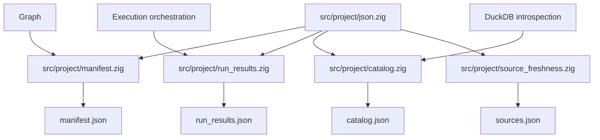
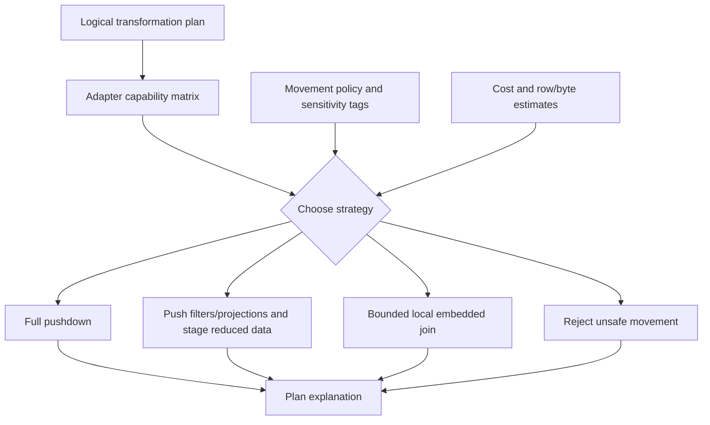

# Architecture

dxt is organized around a native Zig product runtime. Python tooling is outside
the product boundary and is used only for validation, fixtures, oracle
comparison, and safety scans.

## Runtime Boundary

## Module Ownership

| Module | Current responsibility |
| --- | --- |
| `src/main.zig` | Thin process entrypoint. |
| `src/root.zig` | CLI parsing, command dispatch, and user-facing error mapping. |
| `src/project.zig` | Public facade and orchestration while extraction continues. |
| `src/project/types.zig` | Core graph, node, source, test, macro, config, and runtime data model. |
| `src/project/config.zig` | `dbt_project.yml` and project config parsing. |
| `src/project/clean.zig` | Safe project-relative clean-target deletion. |
| `src/project/profile.zig` | Narrow profile/target/adapter identity parsing. |
| `src/project/fs.zig` | Deterministic file discovery. |
| `src/project/loader.zig` | Project/package loading order and graph construction callbacks. |
| `src/project/parse.zig` | YAML resource parsing, macro/test block parsing, source/exposure helpers, generic test naming. |
| `src/project/jinja.zig` | Lexical SQL/Jinja scanning for supported dependency/config surfaces. |
| `src/project/resolve.zig` | Dependency resolution, duplicate checks, sorting, macro lookup. |
| `src/project/selector.zig` | Selector matching, graph expansion, wildcards. |
| `src/project/compiler.zig` | Render-only compiler subset and relation rendering. |
| `src/project/duckdb.zig` | Current DuckDB CLI-backed SQL execution/introspection. |
| `src/project/json.zig` | Shared JSON writer helpers for strings, nullable strings, booleans, object fields, and string arrays using Zig `std.json`. |
| `src/project/manifest.zig` | Manifest v12-shaped JSON writer. |
| `src/project/run_results.zig` | Run Results v6-shaped JSON writer. |
| `src/project/catalog.zig` | Catalog v1-shaped JSON writer. |
| `src/project/source_freshness.zig` | Source freshness status and Sources v3-shaped writer. |

`src/project.zig` is intentionally a transition facade. New shared behavior
should move toward focused `src/project/*.zig` modules.

## Parse To Artifact Flow

## Execution Flow

## Artifact Ownership

## Future Cross-Database Planner

The planner must preserve source relation identity, model data movement
explicitly, enforce policy before execution, and record rejected strategies.
