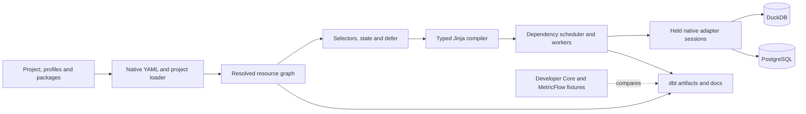
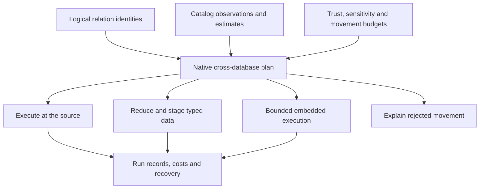

# Architecture

dxt is a native Zig engine with an initial dbt SQL execution scope. Project loading, Jinja evaluation,
selection, SQL planning, warehouse execution and artifact writing run inside the
binary. Python belongs to developer fixtures, upstream comparisons and release
checks. DuckDB and PostgreSQL are the initial execution targets; support for
another adapter requires its own driver and warehouse certification.
The initial release executes SQL models. Python-authored models remain visible
to discovery, parsing, selection and compilation; selecting them for execution
fails before warehouse writes. Their authored code is never imported or run.

## Runtime Boundary

```mermaid
flowchart LR
    Files[Project, profiles and packages] --> Load[Native YAML and project loader]
    Load --> Graph[Resolved resource graph]
    Graph --> Select[Selectors, state and defer]
    Select --> Compile[Typed Jinja compiler]
    Compile --> Schedule[Dependency scheduler and workers]
    Schedule --> Adapter[Held native adapter sessions]
    Adapter --> DuckDB[(DuckDB)]
    Adapter --> Postgres[(PostgreSQL)]
    Graph --> Artifacts[dbt artifacts and docs]
    Schedule --> Artifacts
    Oracle[Developer Core and MetricFlow fixtures] -. compares .-> Artifacts
```

`src/main.zig` creates invocation metadata and a command-lifetime DuckDB pool.
`src/root.zig` handles command parsing, environment/option precedence and exit
codes. `src/project.zig` remains the orchestration facade; focused modules own
the parser, compiler, adapters, schedulers and artifact contracts.

## Project And Compiler Model

The loader reads project/profile configuration, SQL and Python model files,
properties, seeds, snapshots, unit fixtures and installed packages into
`types.Graph`. Resources
retain dbt unique IDs, raw and effective configuration, dependency edges,
versions, groups and access metadata. `resolve.zig` resolves references and
macro namespaces; selector expressions operate on that shared graph.

`naming.zig` evaluates database/schema/alias generators in the parse context and
stores owned resolved identities. Package scopes, adapter dispatch, model
versions, seeds, snapshots and persisted audit relations share those identities
through `this`, `ref`, compilation and cache restores. Saved-query exports also
use the pinned generator policy while retaining configured export overrides.

`python_model.zig` inspects Python syntax through a statically linked
Tree-sitter frontend. It records literal `dbt.ref()`, `dbt.source()` and
`dbt.config()` metadata without evaluating authored code. Compilation appends
the pinned dbt Python scaffold through the native macro compiler and preserves
the model's language, source, dependencies and configuration in artifacts.
Unsupported or dynamic metadata expressions fail visibly. This resource
contract does not broaden the initial SQL execution scope.

`yaml.zig` uses statically compiled libyaml events and constructs the document
model in Zig, including tags, aliases, merges and source diagnostics. Project,
profile and resource configuration use the same reader. Dependency installation
supports local, Git and registry packages with lock-file and offline behavior.
Git/network/archive transports invoke system `git`, `curl` and `tar` tools;
dependency resolution, validation and installation orchestration remain Zig.

The Jinja compiler evaluates native typed values, macro defaults and keyword
arguments, nested returns, filters, mutable containers and control blocks.
`dbt_context.zig` supplies Relation and Column objects; `context_values.zig`
supplies dbt/model/config context, and `timestamp_context.zig` supplies timestamp
objects. `ref()` and `source()` produce typed relations, so package macros can
inspect their components and quoting behavior. Implicit SQL rendering can apply
empty, sample and microbatch input bounds while explicit `.render()` retains the
base relation identity. Ephemeral dependencies become injected CTEs.

Bundled dbt, DuckDB and PostgreSQL SQL macros are embedded from pinned upstream
sources. Package/project overrides and adapter dispatch use the native macro
resolver. Database-backed context functions, including `run_query`, statement
results and adapter introspection, use a native execution host and held session.
They do not invoke a Python template engine or installed dbt runtime.
Invocation-owned relation metadata caches coordinate worker introspection and
invalidate entries when native SQL changes relation/schema state.

`regex_context.zig` exposes native `modules.re` functions and typed pattern/match
values. Zig owns argument binding, Python-pattern normalization, captures,
substitutions and iteration over the statically linked PCRE2 10.44 UTF-8 engine.
Unicode tables and named-character data retain their pinned provenance. This
provider does not invoke an interpreter or require an external regex library.

`modules_context.zig` supplies Core's restricted `pytz`, `datetime`, `re` and
`itertools` namespaces through native providers and an owned render cache.
Date/datetime/time/timedelta/tzinfo values use native calendar and parsing
helpers; timezone localization/normalization uses embedded pytz **2026.5** /
IANA **2026e** transitions. `expression_format.zig` implements `str.format` and
`format_map`, including typed temporal format specifications.

`expression_sequence.zig` and `itertools_context.zig` retain mutable stream
cursors and buffers across aliases and macro returns. Pulls are lazy; callbacks
resolve through the active consuming Jinja host rather than borrowing a host
from a completed macro frame. Internal descriptors remain opaque to authored
attribute/subscript access. These APIs have native and actual Core positive,
negative, consumption and identity comparisons; canonical helper behavior
targets CPython **3.12** without executing a Python interpreter.

## Adapters And Execution

`adapter.zig` defines the shared `Session` and `QueryResult` contracts: typed
columns, nullable cells, affected rows, transactions, cancellation and
introspection. `native_duckdb.zig` dynamically loads DuckDB's C API and shares
database handles across bounded workers. `native_postgres.zig` dynamically loads
libpq and opens PostgreSQL sessions from the selected profile.

DuckDB defaults to automatic library discovery. `DXT_DUCKDB_LIBRARY` selects a
specific library; `DXT_DUCKDB_BACKEND=native` requires native execution.
Database-backed commands use held native sessions and reject forced CLI
execution. The retained `adapter.queryJson` compatibility API supports DuckDB CLI autocommit queries,
with separate SELECT/NULL/empty-result conformance. PostgreSQL loads
`libpq.so.5` by default, with
`DXT_POSTGRES_LIBRARY` available as an explicit override.

`duckdb_profile.zig` validates and applies private native connection options,
settings, attachments, extensions, secrets, lifetime/transaction policies and
typed retry configuration. Credentials are excluded from public target/cache
artifacts. Python-dependent plugin, filesystem and remote profile facilities
produce explicit errors before opening the warehouse.

`concurrent_runner.zig`, `concurrent_compiler.zig` and `scheduler.zig` coordinate
selected resources and their prerequisites. `--threads` bounds work; unit tests
gate their target models, data tests gate dependent build resources, and
ephemeral ancestry remains part of dependency readiness. Failures retain
completed result rows, skip blocked descendants and let independent resources
continue. Fail-fast requests cancel active native queries and stop additional
work. Results include timings, thread IDs and adapter responses.

Materialization modules own adapter-specific table/view, incremental, seed and
snapshot behavior. `microbatch.zig` computes calendar batches and
`microbatch_run.zig` executes each batch in a held transaction, with event-time
input bounds, lookback, partial-success outcomes and failed-batch retry. The
DuckDB stock microbatch implementation is a dxt extension; the pinned
dbt-duckdb adapter requires a custom strategy for the comparable Core batch
fixture. Unit fixtures execute in isolated database scopes.

`commands.zig` implements connection debugging, scaffolding, operations, clone
and retry. Retry reads prior `run_results.json`, restores the original command
arguments and filters execution by exact failed/skipped IDs. `state.zig` and
`defer.zig` consume upstream-shaped artifacts for selection and relation
deferral. These are separate from dxt's versioned environment workflow.

## SQL, Metrics And Cross-Database Planning

SQL analysis uses each dialect's grammar: the statically linked libpg_query
PostgreSQL parser and DuckDB's native `json_serialize_sql` AST. `sql_ir.zig` and
`sql_analysis.zig` normalize operators, bind warehouse/project columns and
types, compute lineage and report source locations. Analysis caches include
compiled SQL, parser identity and dependency/schema fingerprints.

`semantic.zig` loads semantic models, metrics and saved queries.
`metric_plan.zig` produces SQL, an explainable logical plan and explicit relation
bindings for simple, cumulative, ratio, derived and conversion metrics. It
checks entity join paths, aggregation grain, time-spine requirements, offsets
and non-additive dimensions. `metric_command.zig` executes plans or materializes
saved-query exports on the supported adapters.

```mermaid
flowchart TD
    Bindings[Logical relation identities] --> Plan[Native cross-database plan]
    Catalog[Catalog observations and estimates] --> Plan
    Policy[Trust, sensitivity and movement budgets] --> Plan
    Plan --> Pushdown[Execute at the source]
    Plan --> Stage[Reduce and stage typed data]
    Plan --> Local[Bounded embedded execution]
    Plan --> Deny[Explain rejected movement]
    Pushdown --> Journal[Run records, costs and recovery]
    Stage --> Journal
    Local --> Journal
```

`cross_database.zig` exposes named-connection planning and the shared
`planQuery` / `executeQueryPlan` API used by semantic queries. Connection names
and policies live in `dxt_connections.yml`; credentials remain in dbt profiles.
Execution separates source identity from destination identity, reduces data at
source boundaries, streams typed batches and enforces row, byte, memory, spill,
object, duration and cost limits. Focused modules own catalogs, retained stages,
incremental watermarks, scheduling and recovery records. File and PostgreSQL
transaction advisory locks guard persistent targets, including saved exports.

`workflow.zig` provides dxt-specific immutable model versions, isolated
environment views, audited promotion/rollback and processed UTC intervals.
Its versioned plan/environment/run artifacts and `_dxt` warehouse state are
separate from dbt snapshots, dbt incremental materializations and dbt schemas.

## Module Map

| Modules | Responsibility |
| --- | --- |
| `config`, `profile`, `project_config`, `resource_config`, `properties`, `yaml` | Shared configuration/document parsing and precedence. |
| `loader`, `parse`, `python_model`, `resolve`, `model_versions`, `group_access` | Resource construction, static Python metadata, dependency resolution and access validation. |
| `selector`, `selection_expression`, `selector_config`, `state`, `defer` | Selection and upstream artifact state. |
| `compiler`, `expression`, `dbt_context`, `context_values`, `adapter_context` | Typed rendering and native database context. |
| `modules_context`, `modules_datetime`, `timezone_context`, `itertools_context`, `expression_format` | Restricted module providers, temporal values, lazy iterators and typed string formatting. |
| `adapter`, `adapter_result`, `native_duckdb`, `native_postgres`, `relation_cache`, `postgres_catalog` | Native connection/result boundary and warehouse metadata. |
| `scheduler`, `concurrent_runner`, `concurrent_compiler` | Dependency readiness, workers and cancellation. |
| `incremental`, `postgres_incremental`, `microbatch_run`, `snapshot_runner`, `seed_lifecycle`, `unit_runtime` | Resource execution lifecycles. |
| `manifest`, `run_results`, `catalog`, `source_freshness`, `semantic` | dbt and semantic artifact writers. |
| `sql_parser`, `sql_ir`, `sql_analysis` | Dialect grammar, typed plans, lineage and diagnostics. |
| `metric_plan`, `metric_command`, `cross_database*`, `workflow*` | Metrics, governed movement and versioned environments. |
| `docs_serve`, `cli_logs`, `invocation`, `timing_profile` | Docs application, logging and invocation/profiling metadata. |

All module names in this table refer to `src/project/<name>.zig`.

## Artifacts And Dependencies

The native writers target Manifest v12, Run Results v6, Catalog v1, Sources v3
and the semantic-interface manifest contract. Invocation IDs and UTC timestamps
come from the native runtime. Compile/docs also write durable results;
compilation-error results are an explicit dxt extension where Core stops before
writing an artifact. SQL/movement/workflow metadata uses separate dxt artifacts.

`docs generate` writes the embedded dbt documentation application and warehouse
catalog. `--static` also writes `static_index.html` with manifest/catalog data
inlined for offline browsing. `docs serve` serves generated artifacts through
the native HTTP server.

| Dependency | Product role | Distribution |
| --- | --- | --- |
| Zig 0.16.0 and libc | Binary implementation/build | Native executable. |
| libyaml 0.2.5 | YAML event scanner/parser | Compiled into the binary; MIT notice. |
| libpg_query 6.2.5, PostgreSQL 17.7 grammar | PostgreSQL SQL AST | Compiled into the binary; upstream and third-party notices. |
| Tree-sitter 0.25.10 and tree-sitter-python 0.23.6 | Static Python model syntax | Compiled into the binary; MIT and retained Unicode/ICU notices. |
| Unicode 15.0 tables | Typed string operations | Embedded tables; Unicode license and provenance. |
| PCRE2 10.44 | Native regular-expression engine | Statically linked UTF-8 engine without JIT; BSD license and source checksums. |
| pytz 2026.5 / IANA 2026e | Native timezone transitions, aliases and country tables | Embedded data; MIT/public-domain notices and checksum provenance. |
| DuckDB C library | DuckDB execution/AST | External native library; CI pins 1.4.2. |
| libpq | PostgreSQL execution | External native library. |
| dbt SQL includes and docs browser | Macro defaults and documentation UI | Embedded sources; upstream licenses/provenance ship with releases. |

Developer comparisons pin dbt Core **1.10.5**, dbt-duckdb **1.9.6**,
dbt-postgres **1.9.1**, MetricFlow **0.208.1** and semantic interfaces **0.9.0**.
Canonical helper comparisons run under CPython **3.12**; documented 3.11
differences do not change the installed native runtime.
The full upstream artifact schema classes, native tests, actual database
fixtures, public projects and installation checks provide compatibility
evidence. They do not establish universal dbt or adapter certification. See
[Compatibility](COMPATIBILITY.md) for the current support boundary and
[Releases](RELEASES.md) for packaging and platform gates.
