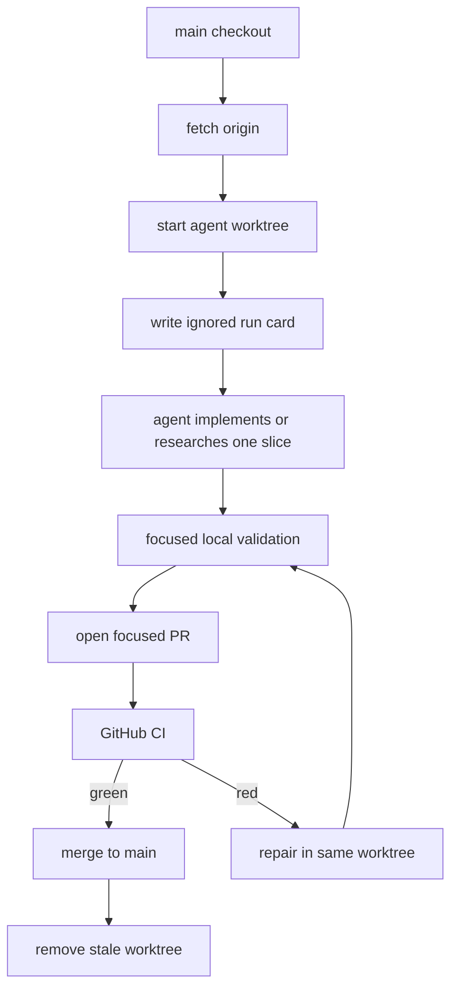
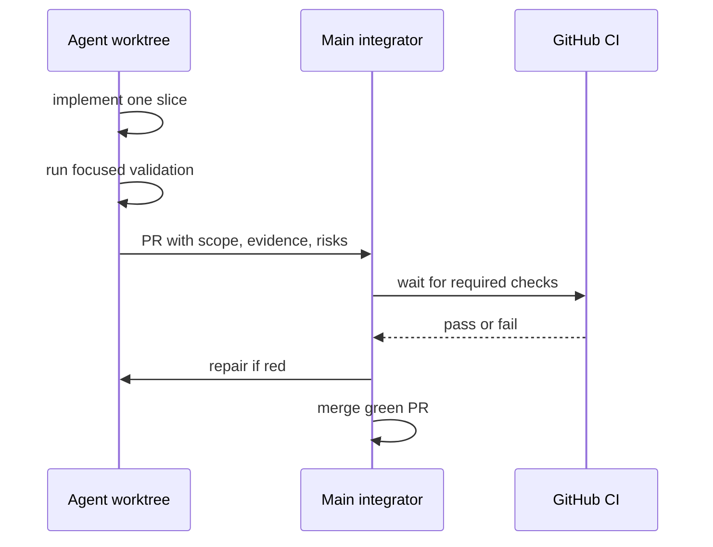

# Multi-Agent Worktree Workflow

This workflow lets multiple Codex instances work on `dxt` at the same time
without sharing a dirty checkout. It is developer orchestration only; product
runtime behavior remains Zig.

For GitHub Issues, Projects, role nudges, and multidisciplinary agent-team
coordination, see [Agent OS](AGENT_OS.md), [Agent Protocols](AGENT_PROTOCOLS.md),
and [GitHub Projects Setup](GITHUB_PROJECTS.md).

The source model is the official Codex subagents and worktrees guidance:
subagents are explicit, bounded workers; worktrees isolate parallel branches;
the main agent remains responsible for integration.

For unattended local execution, use the Agent OS orchestrator. It consumes ready
GitHub issues, creates one worktree per claimed issue, and launches separate
Codex CLI workers. The current default is four parallel workers, configured in
`.github/agent-team/orchestrator.json`; use `--max-workers` when a machine needs
a smaller or larger batch:

```sh
python scripts/agent_os_orchestrator.py run \
  --repo sabino/dxt \
  --profile azure \
  --model gpt-5.5 \
  --max-workers 4 \
  --loop
```

Use `python scripts/agent_os_orchestrator.py status` to watch local worker
state and `python scripts/agent_os_orchestrator.py nudge <issue> "<message>"`
to communicate through GitHub issue comments.

## Core Rules

- One editing agent owns one branch and one git worktree.
- Start new work from `origin/main` unless a stacked branch is explicitly
  planned.
- Keep the main tmux Codex session as supervisor/integrator. It should select
  issues, launch and monitor worker subprocesses, converge PRs, and fix
  orchestration, while issue implementation happens in worker worktrees.
- Prefer read-only subagents for mapping, upstream dbt/Fusion research,
  artifact parity review, and safety checks.
- Use write-capable agents only for one small implementation slice with a
  disjoint file scope.
- Do not make second-agent review a merge requirement. Green CI is the required
  merge gate unless a PR explicitly asks for more review.
- Do not vendor generic subagent catalogs into this repository. Use external
  catalogs only as role-design inspiration.
- Keep local run notes under ignored `.agent/runs/`. Durable public research
  belongs under `.agent/research/` only after public-safety scanning.

## Worktree Loop



Use the helper:

```sh
scripts/worktree_start.sh compat/small-slice
```

The helper creates a sibling worktree under `../dxt-worktrees/` by default,
writes an ignored run card, and prints a ready-to-edit status. Override the
root with `DXT_WORKTREE_ROOT` when needed.

To preview without writing:

```sh
DXT_WORKTREE_DRY_RUN=1 scripts/worktree_start.sh compat/small-slice
```

## Codex CLI Fallback

When interactive subagent spawning is unavailable or at the thread cap, use a
separate Codex CLI process in the worktree.

```sh
DXT_CODEX_PROFILE=<profile> scripts/worktree_start.sh compat/small-slice
cd ../dxt-worktrees/compat/small-slice
codex -p "$DXT_CODEX_PROFILE" -m gpt-5.5 -C "$PWD" \
  --ask-for-approval never --sandbox danger-full-access exec \
  "Read AGENTS.md and PLAN.md. Implement only the requested slice."
```

Use `danger-full-access` for autonomous worker subprocesses that must use host
GitHub auth, push branches, open or update PRs, and write shared Git metadata.
If a fallback worker is intentionally read-only, do not ask it to publish;
route GitHub writes through the supervisor.

Do not commit provider credentials, session transcripts, or machine paths. This
repo intentionally documents the non-secret `azure` profile selector for local
orchestration; override it with `--profile` or `DXT_CODEX_PROFILE` when needed.
If a CLI fallback writes useful findings, summarize them into a public-safe
tracked doc or keep the raw output under `.agent/runs/`.

## Ownership Matrix

| Surface | Typical owner files | Default agent mode |
| --- | --- | --- |
| CLI/root | `src/main.zig`, `src/root.zig` | one writer |
| Parser/loader/config/fs | `src/project/parse.zig`, `src/project/loader.zig`, `src/project/config.zig`, `src/project/fs.zig` | one writer |
| Graph/selector/resolve | `src/project/types.zig`, `src/project/selector.zig`, `src/project/resolve.zig` | one writer |
| Compiler/Jinja | `src/project/compiler.zig`, `src/project/jinja.zig` | one writer |
| Artifacts/JSON | `src/project/manifest.zig`, `src/project/run_results.zig`, `src/project/catalog.zig`, `src/project/source_freshness.zig`, `src/project/json.zig` | one writer |
| DuckDB/runtime | `src/project/duckdb.zig`, execution paths in `src/project.zig` | one writer |
| Docs/release/CI | `README.md`, `docs/**`, `.github/**`, `scripts/**` | may run in parallel with product slices when file scopes do not overlap |

If two branches need the same product module, document the sequencing in
`PLAN.md` before implementation. Do not merge by copying files between
worktrees.

## Project Agent Roles

Project-scoped agent definitions live under `.codex/agents/`. Keep them small
and dxt-specific.

Project-scoped Codex configuration lives in `.codex/config.toml`. It enables
multi-agent workflows for this repo, raises the local thread cap, allows one
recursive delegation layer, registers every dxt agent role, and keeps provider
auth configuration out of tracked files.

For interactive subagents, role sandbox settings remain useful defaults. For
the autonomous Agent OS subprocesses launched by
`scripts/agent_os_orchestrator.py`, the repo-local orchestrator uses
`danger-full-access` so workers can access host GitHub auth, push branches, open
PRs, and write shared Git worktree metadata. Treat the table below as a behavior
contract, not a filesystem sandbox guarantee, when the Agent OS orchestrator is
running.

| Agent | Mode | Use for |
| --- | --- | --- |
| `dxt_product_manager` | GitHub-write, filesystem read-only | Monitor GitHub issue board health, priorities, stale claims, blockers, and readiness nudges. |
| `dxt_code_mapper` | read-only | Map owning Zig modules, fixtures, artifacts, and validation before edits. |
| `dxt_dbt_reference_researcher` | read-only | Name upstream dbt Core v1/Fusion source files, affected artifact fields, and stop conditions. |
| `dxt_zig_slice_worker` | workspace-write | Implement one tightly scoped Zig product slice in one worktree. |
| `dxt_artifact_parity_reviewer` | read-only | Review manifest/run-results/catalog/sources shape and schema parity. |
| `dxt_runtime_boundary_auditor` | read-only | Check Python stayed in tests/scripts/oracles and product behavior stayed Zig. |
| `dxt_convergence_reviewer` | read-only | Review a PR-boundary diff for overlap, generated noise, missing tests, and public-safety risk. |

## Agent Output Contract

Every delegated result should include:

- Scope owned.
- Files read or changed.
- Behavior claim or finding.
- Validation command and result.
- Unresolved risks.
- Exact handoff recommendation.

For implementation agents, also include the branch name and whether the working
tree is clean.

## Validation Gates

Run only the relevant local gates while working; let GitHub CI carry the broad
matrix.

| Change type | Local gate |
| --- | --- |
| Docs/scripts only | `git diff --check`, `sh -n scripts/*.sh`, `python scripts/check_public_safety.py` |
| Zig core logic | `zig fmt --check` on touched Zig files, `zig build test` |
| CLI/artifact behavior | Focused `pytest` for the changed behavior plus native tests |
| Runner/artifact high-risk change | `zig build`, `zig build test`, relevant focused pytest, optionally full `pytest -q` |
| Jaffle-facing behavior | Relevant public Jaffle parse/build/run/docs harness, not every harness by default |
| PR boundary | `python scripts/check_runtime_boundary.py`, `python scripts/check_public_safety.py`, `git diff --check`, green GitHub CI |

Use `scripts/worktree_finish.sh` before committing or opening a PR.

## Convergence



Before merging:

- Rebase on current `origin/main`.
- Inspect `git status --short --branch`.
- Confirm no generated targets, caches, logs, private paths, or session
  transcripts are tracked.
- Confirm overlapping branches are either merged first or explicitly re-scoped.
- Merge after required checks pass.

The local `merge-ready` queue enforces this policy for autonomous convergence:
it skips draft PRs, PRs without green checks, PRs whose GitHub merge state is
not clean, PRs that declare open dependencies, and later PRs whose changed files
overlap an earlier queued PR. With `--apply`, it posts a concise merge fan-in
comment back to linked issues after each successful merge.

After merging:

- Delete the remote branch if appropriate.
- Remove or prune stale worktrees only after checking they have no uncommitted
  work.

## Stop Conditions

Stop and hand off instead of broadening scope when:

- The current worktree has unrelated or unclear uncommitted changes.
- The slice needs the same files another active branch owns.
- A local validation gate fails for a reason outside the slice.
- A change would move product CLI, parser, compiler, graph, artifact, planner,
  adapter, or runtime behavior into Python.
- Public-safety scans find local paths, private hostnames, tokens, caches, logs,
  or session text in tracked files.
