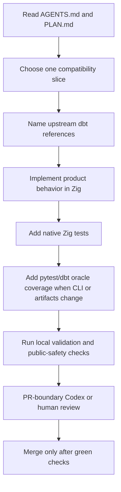
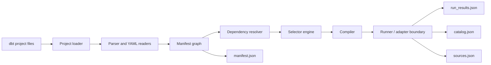

# dxt Primer

`dxt` means **Data eXecution & Transformation**. It is a Zig-first,
dbt-project-compatible transformation engine. The first product requirement is
dbt Core compatibility; Fusion, semantic resources, metrics, and
cross-database execution influence the architecture but do not replace the dbt
Core compatibility base.

## Product Contract

- Product runtime is Zig.
- Python is allowed only for developer tests, fixtures, dbt oracle harnesses,
  schema validation, safety scans, and scripts.
- dbt artifact shape is a compatibility contract.
- Each compatibility slice should name upstream dbt Core v1 and, where useful,
  dbt Core v2 / Fusion source files.
- Local deterministic fixtures come before live warehouses.

## What dxt Does Today

The current pre-alpha CLI can load supported dbt project files, build a graph,
write dbt-shaped artifacts, and execute selected DuckDB slices. The implemented
commands are:

- `dxt parse`
- `dxt ls`
- `dxt clean`
- `dxt compile`
- `dxt run`
- `dxt test`
- `dxt build`
- `dxt docs generate`
- `dxt docs serve`
- `dxt source freshness`
- `dxt version`

The current execution backend is DuckDB through a Zig-owned external CLI
boundary. That boundary is temporary; adapter behavior should move behind a
native adapter ABI as the runtime matures.

## Operating Model

## Project Flow

## Artifact-First Compatibility

dxt should not invent dbt artifact fields. When it emits a field, tests should
cover the field and schema validation should know about it. dxt-specific
metadata belongs in a namespaced future artifact, not inside dbt schemas unless
the schema permits it.

Current artifact writers:

- `src/project/manifest.zig` writes the current Manifest v12-shaped slice.
- `src/project/run_results.zig` writes the current Run Results v6-shaped slice.
- `src/project/catalog.zig` writes the current Catalog v1-shaped slice.
- `src/project/source_freshness.zig` writes the current Sources v3-shaped slice.

## Source-Grounded Feature Work

Every new compatibility slice should record:

- dbt Core v1 reference files and functions/classes.
- dbt Core v2 / Fusion reference files when relevant.
- owning dxt Zig module.
- affected artifact maps and schemas.
- native Zig tests.
- Python/dbt oracle tests for CLI, fixture, filesystem, or artifact behavior.
- stop conditions that keep the slice reviewable.

Public-safe research notes live in `.agent/research/`. Disposable run logs live
in `.agent/runs/` and stay ignored.

## Validation Layers

| Layer | Command | Purpose |
| --- | --- | --- |
| Native compile | `zig build` | Compile the CLI and catch import/type issues. |
| Native unit tests | `zig build test` | Fast tests for parser, selector, graph, manifest, compiler, and helpers. |
| Focused integration tests | `pytest -q tests/test_cli.py::...` | Local black-box checks against the native binary for touched CLI/artifact behavior. |
| Full integration matrix | GitHub CI `test py3.11/py3.12` | Full pytest fixture coverage with JUnit reports, without repeating native release builds in every Python job. |
| Runtime boundary | `python scripts/check_runtime_boundary.py` | Prevent Python product-runtime drift. |
| Public safety | `python scripts/check_public_safety.py` | Catch secrets, local paths, generated noise, and private artifacts. |
| Public fixture gates | `scripts/check_jaffle_shop_duckdb_*.py` | Validate current public Jaffle-style parse/build subsets; CI currently runs the parse gate and keeps the DuckDB build gate available for local/expanded CI runs. |

## Where To Start

- Read [Compatibility Matrix](COMPATIBILITY.md) to understand current support.
- Read [Architecture](ARCHITECTURE.md) before changing module ownership.
- Read [Release Process](RELEASES.md) before cutting a tag.
- Read [PLAN.md](../PLAN.md) before multi-file work.
